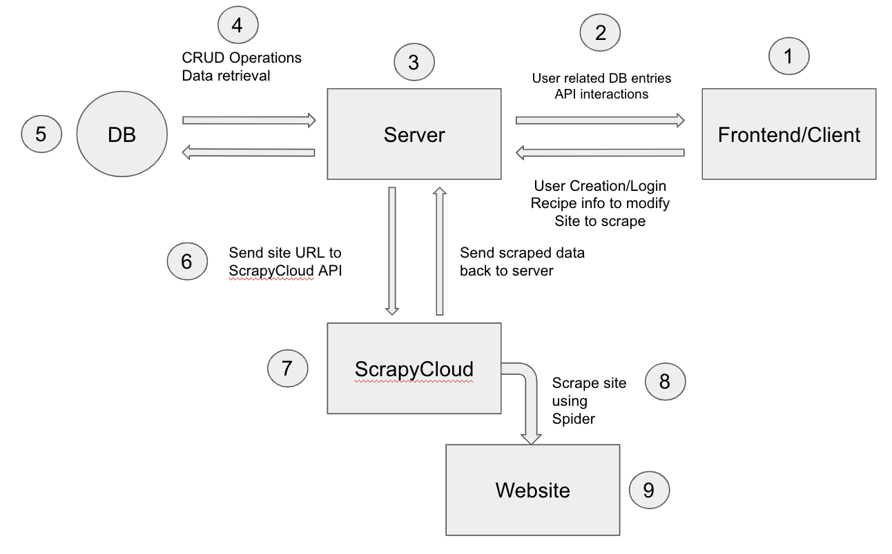

# Dog-Ear Recipe Repository

### CSCA 5028: Final Project Report

### Created By: Tyler Winstead

### Live Link: [https://dog-ear-v3-e506b35ffcf6.herokuapp.com/login](https://dog-ear-v3-e506b35ffcf6.herokuapp.com/login)

### Github Repo: [https://github.com/tywi6665/Dog-Ear_v3-modified](https://github.com/tywi6665/Dog-Ear_v3-modified)

### Zyte Project (Scrapy Cloud): [https://app.zyte.com/p/699195/jobs](https://app.zyte.com/p/699195/jobs)

#### Project History:

This is a personal project that I have been working on for some time now. Given the requirements for the final project of this course, and where I was in the development process of Dog-Ear, I thought it a great idea to “kill two birds with one stone” and submit it as my final project.

The idea for Dog-Ear was born out of my partner’s love and passion for cooking. While scrolling through online cooking resources (nyt cooking, food52, etc.), they would save/bookmark recipes for later use, and that is where the problem laid. Each saved recipe would only exist on the website on which it was saved, so finding a specific recipe among many different sites and accounts became tedious and a hassle. I set out to create a tool where all recipes could be saved in a single location, and Dog-Ear Recipe Repository was born.

#### Project Description:

Dog-Ear consists of 4 key components: a simple registration/login system, an interactive recipe catalog, a REST API and a webpage scraper. Once a new user creates an account and verifies their email, they are able to login. After logging in, the user is redirected to the catalog page where all of their saved recipes are displayed. If recipes already exist in their catalog, they can click on a recipe card upon which they navigate to the details page for that specific recipe. While there, they can rate the recipe, add tags/notes, or more generally edit/update the recipe. Back on the catalog page, if the user wishes to add a new recipe they have two options. They can enter all the recipe info manually using a blank template, or they can enter the recipe URL and let a web scraper/spider extract that info for them. Either way, once recipe info fields are populated, the recipe can be saved and added to the catalog.

#### Project Architecture:

1. Frontend/Client
   - Built using React.js framework
     - Justification for using React.js
       - It’s a framework I’m comfortable using
       - Reusable components
       - Virtual DOM
       - Strong support and large community
   - This is where the user interacts with the application. The user can scroll through the recipe catalog as well as navigate to recipe pages via react-router-dom. React-router-dom allows for relative url paths to be used since React does not support that natively. Recipe stats and average rating can be found on the Stats page.
2. Frontend to Backend Communication
   - The frontend end queries the backend/Django api routes to receive/send data (user, recipe)
   - This communication facilitates user creation, account verification, log in/out, CRUD commands for saved recipes, and passing along URLs to scrape
3. Backend/Server
   - Built using Django framework
     - Justification for using Django
       - Ease of use and efficiency
       - Robust security features
       - Strong support and large community
   - In addition to serving the frontend/React files, it also acts as the bridge between the frontend and the database. Django’s prebuilt REST API methods and some custom methods allow for recipe CRUD operations. A utility called Djoser extends the Django framework and makes user creation and validation relatively straightforward.
4. Server to DB Communication
   - Depending on the API method queried, data traffic is either sent to or retrieved from the desired db table
5. Database
   - SQL
     - Justification for using SQL db
       - Atomicity
       - Consistency
       - Transaction isolation
   - Where data is stored
6. Server to ScrapyCloud Communication \* er to ScrapyCloud Communication
   The Scrapy Cloud API is queried with a secret api key and the recipe website URL pasted in on the frontend as a parameter. This signals the recipe spider to start crawling. Once the spider has completed running, the scraped data is sent back to the server.
7. Scrapy Cloud Service
   - Uses scraping utility Scrapy
     - Justification for using scrapy as web scraper
       - Is a web scraping framework
       - Can define a root URL, and it will be able to crawl, download, and save content from web pages
   - Zyte.com
     - Justification for using Zyte.com to host spider
       - Zyte was developed by the same group that created the scraping utility scrapy
       - Inherent support for scrapy
   - This cloud service is where the custom Dog-Ear recipe spider is hosted. When it receives a call from the server it starts the scraping process. The scraped data is processed and then sent back to the server.
8. Spider
   - Navigates to the provided URL and scrapes the desired data
9. Recipe Website
   - 3rd party website that hosts the recipe the user wants to save in Dog-Ear
10. Hosting Service
    - Dog-Ear is hosted on Heroku

### System Requirements & Utilities:

- Backend
  - Django
    - Testable; Both unit and integration
  - Djoser
    - Testable; Both unit and integration
  - SQL DB
  - Scrapy
    - Testable; Primarily unit
  - Django-Prometheus
  - Django-Health-Check
  - Scrapinghub
- Frontend
  - React.js
  - Antd (Component Framework)
  - Tailwindcss
- Heroku

### Project Requirements (from project rubric):

- Web application basic form, reporting
  - There is a login form and also reporting form for recipes created either using a blank template or by scrapy the website
  - https://dog-ear-v3-e506b35ffcf6.herokuapp.com/login
- Data collection
  - After pasting a URL, a scrapy spider crawls that webpage and return data such as title, author, etc.
    - Click the floating button in the lower right of the screen and then click on the dog icon. A modal will appear with a text field. Paste the url there.
- Data analyzer
  - Within the Stats page, the average recipe rating is calculated and the ratings distribution is displayed
    - Click the floating button in the lower right of the screen and then click on the bar chart icon. You will be redircted to the Statistics page
- Unit tests
  - Recipe Model test: https://github.com/tywi6665/Dog-Ear_v3-modified/blob/main/apps/recipes/tests.py
  - Scrapy Spider test: https://github.com/tywi6665/Dog-Ear_v3-modified/blob/main/apps/scraper/tests.py
- Data persistence
  - Recipes are saved and displayed in the catalog. Recipe data can also be updated and saved (https://dog-ear-v3-e506b35ffcf6.herokuapp.com/catalog)
- Rest collaboration internal or API endpoint
  - RESTful API endpoints in the Django backend allow for CRUD operations.
  - Querying the Scrapy Cloud API endpoint starts the scraping process
- Product environment
  - Dog-Ear is deployed and hosted on Heroku (https://dog-ear-v3-e506b35ffcf6.herokuapp.com/login)
- Integration tests
  - User registration with email validation tests (https://github.com/tywi6665/Dog-Ear_v3-modified/blob/main/apps/accounts/tests.py)
- Using mock objects or any test doubles
  - User data is faked for the User registration with validation tests (https://github.com/tywi6665/Dog-Ear_v3-modified/blob/main/apps/accounts/tests.py)
- Continuous integration
  - Code versioning via GitHub repo (https://github.com/tywi6665/Dog-Ear_v3-modified)
- Production monitoring Instrumenting
  - Prometheus metrics: https://dog-ear-v3-e506b35ffcf6.herokuapp.com/metrics
  - DB Health: https://dog-ear-v3-e506b35ffcf6.herokuapp.com/health/
- Event collaboration messaging
  - None
- Continuous delivery
  - My github is linked with my Heroku account. A push to my main branch automatically kicks off a new production build process on Heroku
